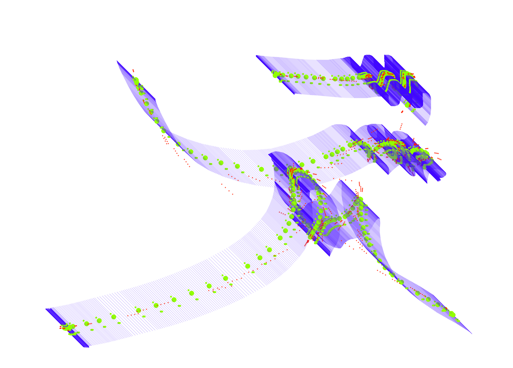
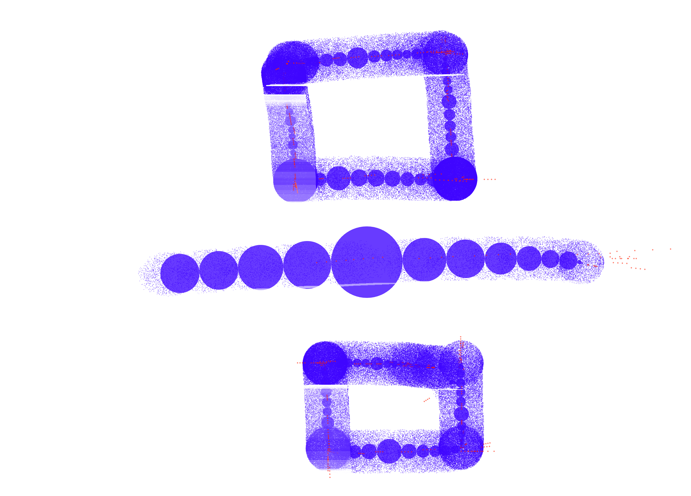

# Drawing Env p5

Drawing environment made with p5.js for a two day workshop in Hongik University in Seoul. An experiment to create forms while learing Hangul.

### results:

## To Do:

- [ ] Clean up Code
- [ ] Implement p5.riso
